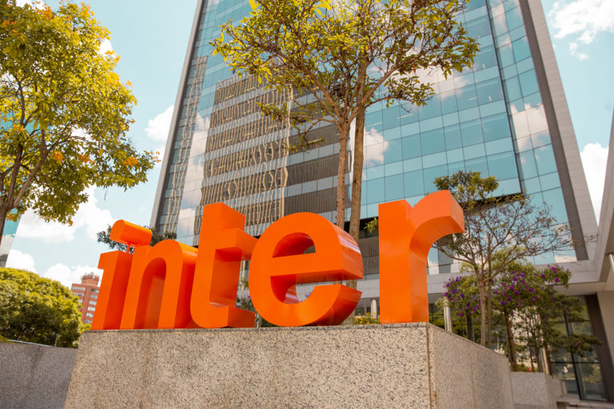
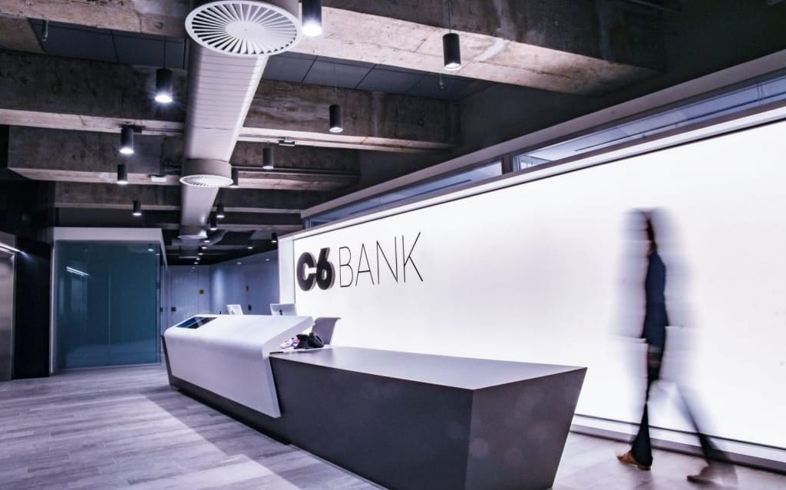

Nossos principais clientes estão no ramo financeiro brasileiro, incorporados por meio dos Bancos Digitais:

<h1 align="center">Nubank</h1>

    <apan align="center">
      
    

Um dos maiores bancos digitais do Brasil, conhecido por sua inovação e foco na experiência do cliente, ofertando seus diversos produtos e benefícios com facilidade.

<h1 align="center">Inter</h1>

    <apan align="center">
      
    

Um banco digital que oferece uma ampla gama de serviços financeiros, incluindo conta corrente, investimentos, e até mesmo com saques gratuitos.

<h1 align="center">Neon</h1>

    <apan align="center">
      
    

Uma instituição financeira digital que oferece serviços de conta corrente, cartão de crédito e investimentos.

<h1 align="center">C6 Bank</h1>

    <apan align="center">
      
    

Um banco digital que oferece uma variedade de produtos financeiros, incluindo conta corrente, cartão de crédito, investimentos bem como conta internacional.

